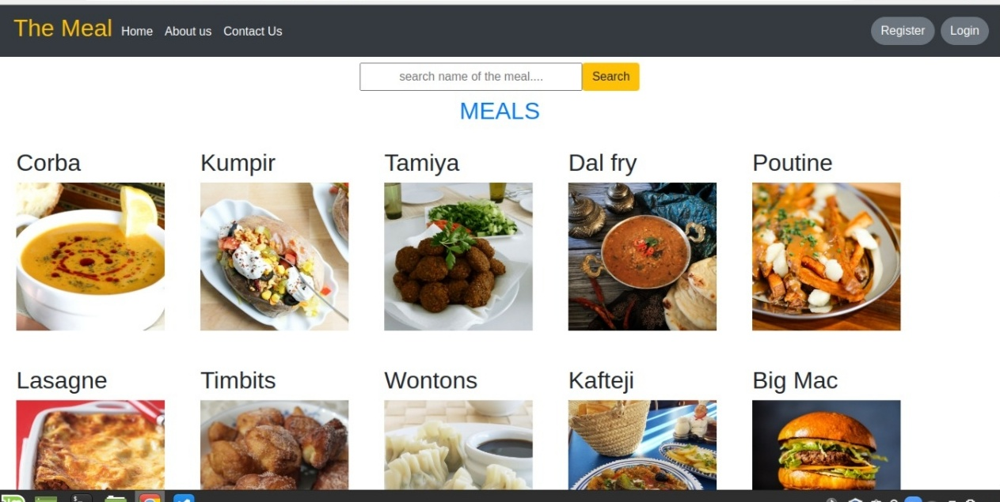
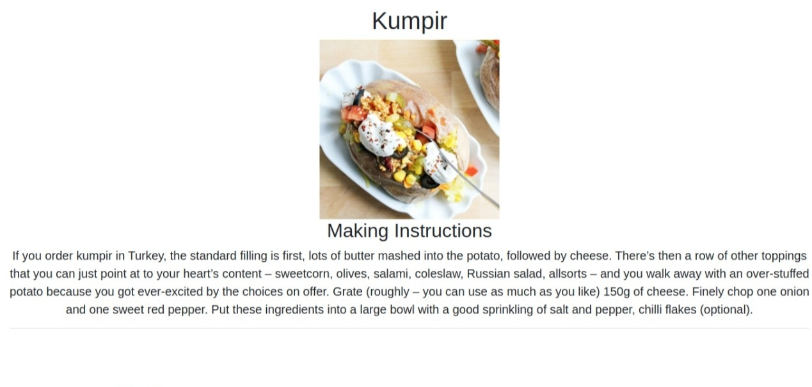
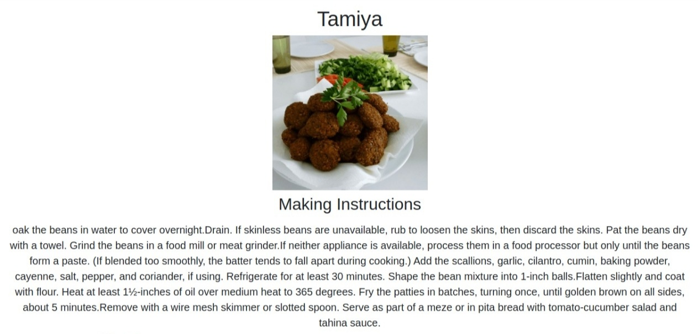

# project-The Meal
I have created these project using API. Below is the look of my project's homepage.

## Second part
These is the second page where user will be redirected when clicking on any meal to get more information.

## Third part 
These is the search result when user search for something.

## TECH STACK USED
* HTML
* CSS
* JAVASCRIPT
* BOOTSTRAP
